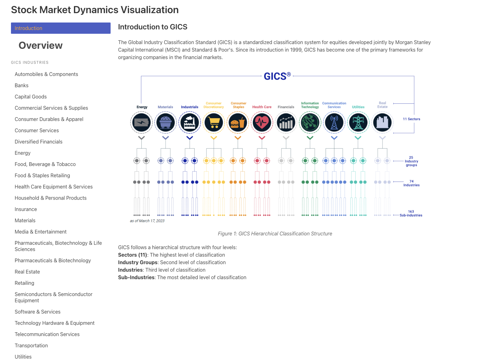
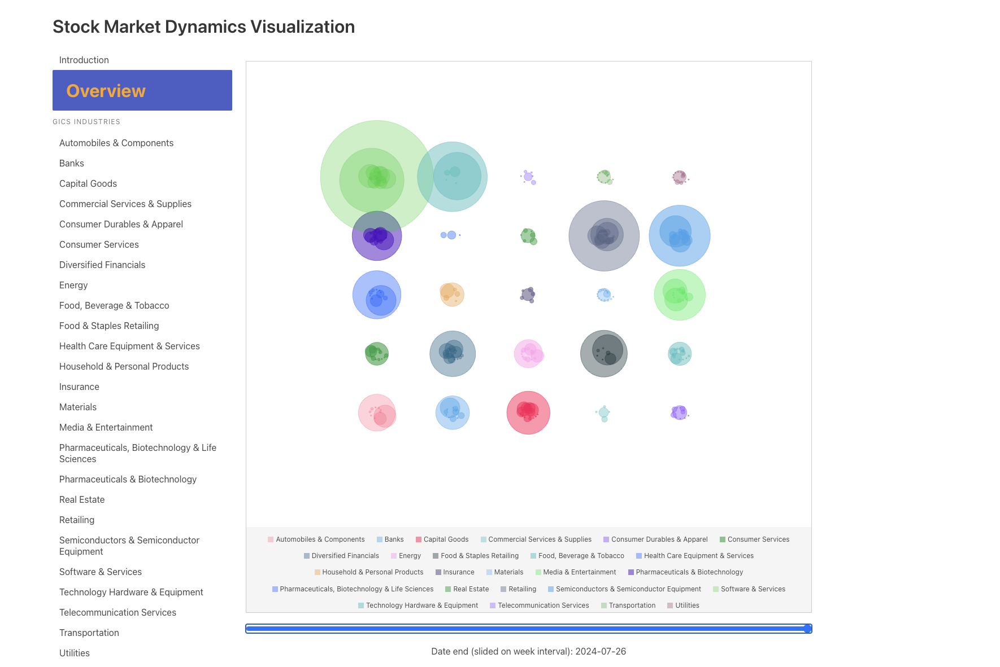
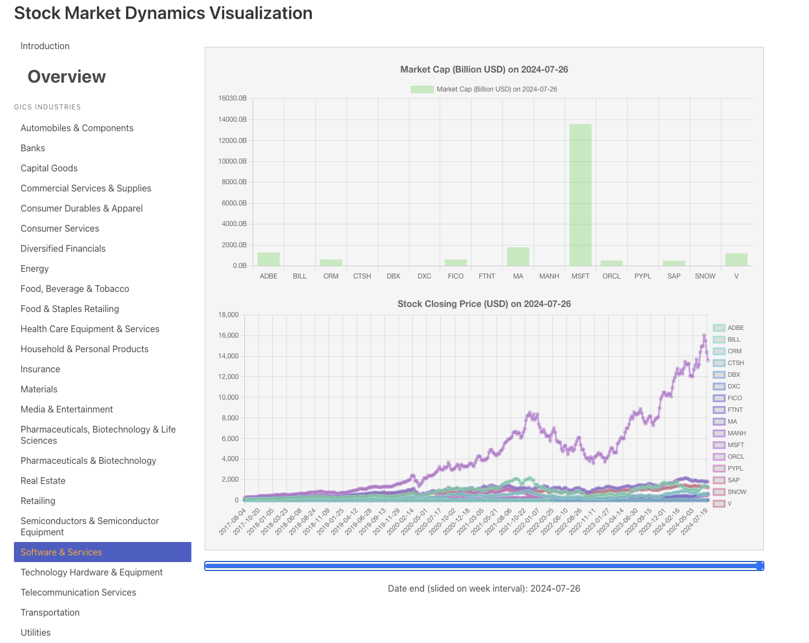

# Market Dynamic Visualization

## Project Overview
Market Dynamic Visualization is the course project for the  CS-6630 at University of Utah. On this project, we build a web application that allows users to visualize the dynamic of market captialization within various industrial subsectors. 

## Project Links
We host the project via the github page.
- **Project Website:** [https://dataviscourse2024.github.io/group-project-market-dynamic-visualization/ui.html](https://dataviscourse2024.github.io/group-project-market-dynamic-visualization/ui.html)
- **Screencast Video:** [https://youtu.be/your-screencast-video](https://youtu.be/your-screencast-video)
- **Repository:** [https://github.com/dataviscourse2024/group-project-market-dynamic-visualization.git](https://github.com/dataviscourse2024/group-project-market-dynamic-visualization.git)

## Features
### Introduction
On the Introduction page, the users can learn about the industrial sectors we have selected for this project, the GICS standard and its classification. A screenshot video is provided to show the interaction of the page.

### Overview
The overview page shows the market capitalization dynamic of all subsectors. Within each sector, the market captialization of each company is visualized as a bubble. The size of the bubble represents the market capitalization of the company, and the color represents the industry.

### Single Sector
On the other single sector pages, the users can select a specific sector to visualize the market capitalization contribution within the subsectors. Stocks price and market capitalization data are provided.

## Project Structure
### data
We have provided the data we used for this project in the data folder. This data can be re-generated using the code crawler.ipynb.
### scripts
We use javascript to build the frontend part of the application. The main code is in the stock_visualizer.js file. We define the project constants data on constant_data.js file.
### entrypoint
The page is hosted on yi.html.
### resources
The resources include figures and processing books.

## Team Members
- **Zixuan Lu** (u6053162, birdpeople1984@gmail.com)
- **Chun Yuan** (u6052162, u6052162@utah.edu)
